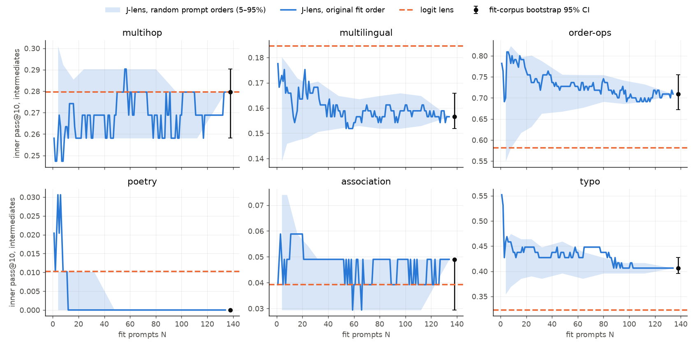
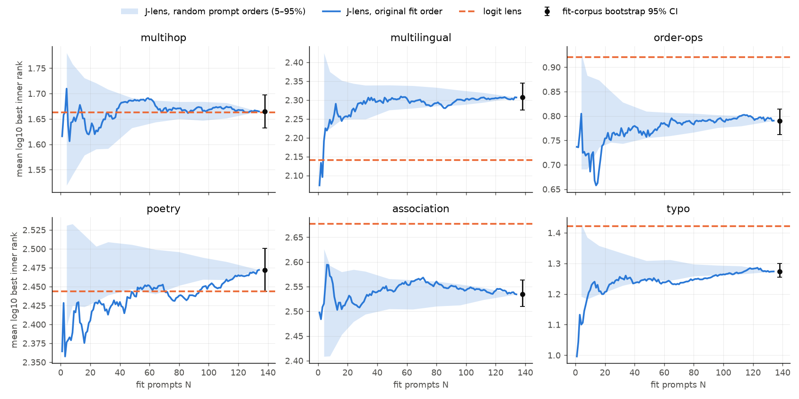

# J-lens на GPT-2 XL: сходимость по числу промптов и доверительные интервалы

**Вывод.** 134 промптов подгонки (`FIT_MIX × 0.25`, линза `gpt2-xl_jacobian_lens_dataset.pt`)
достаточно, дообучать не нужно. Разброс метрик из-за выбора корпуса подгонки и
остаточное смещение от конечного N в 2–5 раз меньше разброса из-за конечного
eval-набора. Доверительный интервал метрик J-lens определяется eval-набором.

Модель `openai-community/gpt2-xl`, fp32, `max_seq_len=128`, `skip_first=16`,
`dim_batch=8`, протокол оценки — как в `notebooks/jacobian_lens/jacobian_logit_lens_dataset.ipynb`
(inner = лучший ранг по слоям 0..46, без выхода модели).

## Метод

J-lens линейна по J: `J_S h = mean_{p∈S} J_p h`. Поэтому при подгонке для каждого
промпта p сохраняется `T_p = H · J_pᵀ` — остаточные потоки всех 551 eval-пунктов в
позиции чтения, перенесённые якобианом этого промпта. Линза, подогнанная на любом
подмножестве промптов S, на eval-наборе — это среднее `T_p` по S; пересчёт метрик
занимает секунды и не требует переподгонки.

Источники неопределённости:

| | что варьируется | как оценено |
|---|---|---|
| **корпус (fit)** | какие 134 промпта попали в подгонку | бутстрап промптов со стратификацией по источнику (B=200); 50 разбиений на непересекающиеся половины 67+67, `sd(134) ≈ sd(h1 − h2)/2` |
| **сходимость** | меняется ли результат при добавлении промптов | кривая по N в исходном порядке и 30 случайных порядках; смещение `mean(половины) − полный`: при смещении ∝ 1/N это и есть остаток при N=134 |
| **eval** | какие пункты попали в eval-набор | бутстрап пунктов внутри датасета (B=2000), парный для J-lens − logit lens |

Проверка: переподгонка тех же 134 промптов воспроизводит снепшот (J совпадают до
fp16-округления, pass@k — точно). Ранги, посчитанные через кэш, совпадают с
`evaluate_paired` (99.3% точных совпадений, pass@10 идентичен).

## Результаты

### Inner pass@10, промежуточные слова (основная метрика)

| | multihop | multilingual | order-ops | poetry | association | typo |
|---|---|---|---|---|---|---|
| J-lens, N=134 | 0.280 | 0.157 | 0.709 | 0.000 | 0.049 | 0.406 |
| **95% ДИ, eval** | [0.194, 0.376] | [0.124, 0.189] | [0.627, 0.791] | — | [0.010, 0.098] | [0.312, 0.510] |
| 95% ДИ, корпус | [0.258, 0.290] | [0.152, 0.166] | [0.672, 0.755] | — | [0.029, 0.049] | [0.396, 0.427] |
| sd eval / sd корпус | 0.047 / 0.009 | 0.017 / 0.004 | 0.042 / 0.022 | 0 / 0 | 0.022 / 0.007 | 0.050 / 0.009 |
| смещение N/2 − N | −0.005 | 0.003 | 0.002 | 0 | −0.009 | 0.007 |
| \|N112 − N134\| | 0.008 | 0.003 | 0.010 | 0 | 0.005 | 0.003 |
| logit lens | 0.280 | 0.185 | 0.582 | 0.010 | 0.039 | 0.323 |
| **J − logit, 95% ДИ** | 0.000 [−0.054, 0.054] | −0.028 [−0.056, −0.002] | **+0.127 [0.027, 0.227]** | −0.010 [−0.031, 0.000] | 0.010 [−0.020, 0.039] | +0.083 [0.000, 0.167] |

* Корпус добавляет к общей дисперсии мало: отношение sd корпус/eval 0.18–0.53 для
  pass@10, 0.12–0.36 для среднего log10-ранга, 0.16–0.53 для pass@100. В худшем
  случае (order-ops, pass@10) общий интервал шире интервала eval примерно на 13%
  (`√(1 + 0.53²)`), обычно на 2–5%.
* Смещение от конечного N мало: ≤ 0.009 по pass@10, ≤ 0.019 по pass@100 (poetry),
  ≤ 0.004 по log10-рангу. Удвоение корпуса уменьшило бы sd корпуса ещё в √2 раз —
  на фоне eval-разброса это незаметно.
* J-lens значимо лучше logit lens только на order-ops; на typo — на границе
  значимости; на multilingual — немного хуже. Остальное в пределах шума. Парный
  интервал учитывает только eval-разброс; добавка от корпуса мала (см. выше).

### Среднее log10 лучшего inner-ранга, промежуточные слова

| | multihop | multilingual | order-ops | poetry | association | typo |
|---|---|---|---|---|---|---|
| J-lens, N=134 | 1.665 | 2.307 | 0.790 | 2.472 | 2.534 | 1.273 |
| sd eval / sd корпус | 0.097 / 0.017 | 0.050 / 0.018 | 0.037 / 0.013 | 0.057 / 0.015 | 0.073 / 0.014 | 0.100 / 0.012 |
| смещение N/2 − N | 0.000 | −0.001 | −0.002 | −0.001 | 0.002 | 0.004 |

Все метрики (pass@1/10/100, log-ранг; промежуточные, control, target) —
`results/summary.csv`; полный вывод — `results/report_stdout.txt`.

### Кривые по числу промптов




Полоса случайных порядков к N=134 сужается в ноль по построению (все порядки дают
один и тот же набор), поэтому сходимость к пределу показывает не она, а интервал
бутстрапа корпуса (точка с усами) и смещение по половинам. Медленный дрейф кривой
исходного порядка (poetry, typo на log-ранге) остаётся внутри полосы — это свойство
конкретного порядка, не тренд. Control: `results/curve_pass10_control.png`.

## Ограничения

* Проверка «134 против 529 промптов» напрямую не доведена: подгонка остановлена
  на 171 промпте, так как оценки выше уже показали достаточность 134. Сделанное
  дополнение сохранено на сервере в `T/g*.pt`; `curves.py` без `--snapshot-only` их учтёт.
* Оценивается только чтение в позиции readout (pass@k, ранги); agreement / copy rate /
  KL по всем позициям не входят.
* Бутстрап по корпусу варьирует промпты внутри тех же источников и `FIT_MIX`;
  чувствительность к самой смеси, `max_seq_len`, `skip_first` не проверялась.
* `T_p` хранится в fp16: ранги порядка 10⁴ сдвигаются на единицы, pass@k (k ≤ 100)
  не меняется.

## Воспроизведение

На GPU-машине (V100 16 ГБ: ~64 с на промпт в fp32; fp16 autocast ~23 с, но точность
J хуже, ~1e-3; TF32 на Volta недоступен):

```bash
cd experiments/convergence
python bench.py                       # промпты (снепшот, затем дополнение) + замер dim_batch
python prepare.py                     # кэш eval-активаций, сверка с evaluate_paired
python fit_tracked.py --dim-batch 8   # T_p по промптам; дозапускается с места остановки
python curves.py --snapshot-only      # ~7 мин на V100 при свободной GPU
python report.py                      # results: summary.csv, графики
```

По умолчанию всё пишется в `/workspace/runs/ci` (`--run-dir`). Нужен
`snapshot_lens_134.pt` (снепшот линзы) в этом каталоге. Место: `T_p` — 83 МБ на
промпт (11 ГБ на 134).
